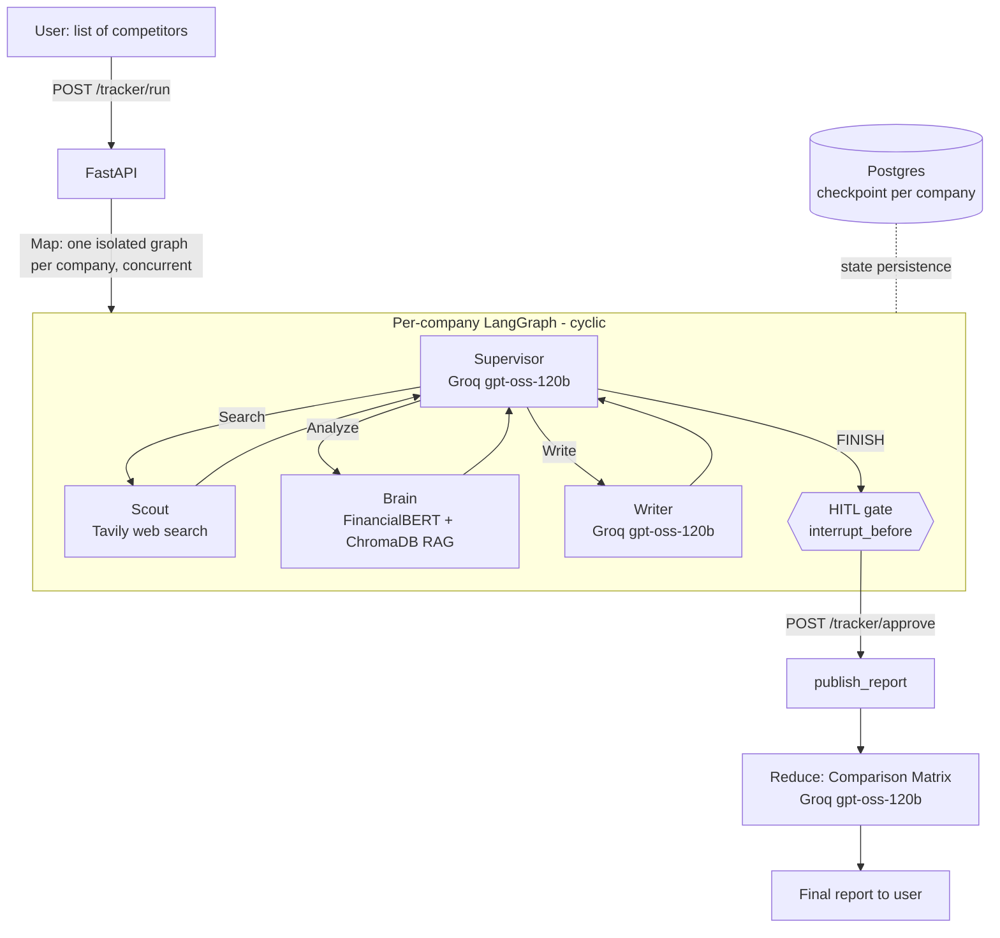

# Tracker

**Autonomous multi-agent competitive intelligence system.** Give it a list of competitors;
a team of LLM agents researches each one concurrently, drafts an executive report, pauses for
human approval, then synthesizes everything into a Competitive Landscape Comparison Matrix.

Built as a hybrid LLM + SLM architecture: expensive reasoning (Groq-hosted open-weight models)
is reserved for routing and writing, while high-volume embedding/retrieval work runs on a free,
local, finance-domain-tuned model. See [`docs/cost_model.md`](docs/cost_model.md) for the numbers.

## Architecture



Each company runs as its own isolated LangGraph state machine (no context pollution between
companies), checkpointed to Postgres after every step so a crash mid-run resumes rather than
restarting. Nothing is "published" until a human explicitly approves it via `/tracker/approve`.

## Tech stack

| Layer | Choice | Why |
|---|---|---|
| API | FastAPI | async-native, plays well with LangGraph's `.ainvoke()` |
| Orchestration | LangGraph | cyclic multi-agent graphs, native HITL interrupts, Postgres checkpointing |
| Routing / Writing LLM | Groq (`openai/gpt-oss-120b`) | genuinely free tier (no card, no usage-history gate), strict structured-output mode, fast LPU inference |
| Embeddings + sentiment | FinancialBERT (local, HuggingFace `transformers`) | $0 per call, domain-tuned |
| Vector memory | ChromaDB (embedded) | zero infra to host |
| Web search | Tavily | free tier, purpose-built for LLM agents |
| Checkpoint store | Postgres (Neon free tier) | required by LangGraph's `PostgresSaver` for durable, resumable state |
| Demo UI | Streamlit | fastest path to a clickable demo in a Python-only stack |

**Why Groq and not Bedrock?** The architecture was originally designed around Amazon Bedrock
(see `hybrid_architecture_tracker.pdf`) for the AWS/enterprise deployment story. In practice,
brand-new AWS accounts get Bedrock token quotas initialized at effectively zero, and AWS's own
quota-increase process requires *using* 90% of your current quota first - a real catch-22 for a
new account that can't make a single call. Rather than block on AWS support cycles, the LLM
layer moved to Groq: same `langchain` `.with_structured_output()` interface, so `app/graph/
supervisor.py` and `app/graph/writer.py` didn't need to change, and it's usable immediately with
no billing/support runaround. Swapping back to Bedrock (or adding it as a second provider) is a
small, contained change - see `app/llm/groq_client.py`.

## Quickstart

```bash
python -m venv .venv
.venv\Scripts\activate          # Windows
pip install -e .

cp .env.example .env            # fill in Groq/Tavily/Postgres credentials
python scripts/seed_historical_data.py   # populate ChromaDB with sample history
python scripts/load_client_context.py data/client_context_template.csv  # optional, see below

python scripts/serve.py         # API on http://localhost:8000
streamlit run ui/streamlit_app.py        # UI on http://localhost:8501
```

### Client & Competitor Context (RAG over your own records, not just the web)

For a consultancy tracking non-public/local businesses, generic web search often turns up thin
or nothing at all - but the firm usually already knows who its clients are and who they compete
with. `scripts/load_client_context.py` loads a CSV (`client_name, client_details,
competitor_name, competitor_details, notes` - see `data/client_context_template.csv`) into its
own ChromaDB collection (`app/memory/client_context.py`), kept separate from the scouted-web-history
collection so curated firm knowledge doesn't get crowded out by web snippets in similarity search.
The Brain agent looks a researched company up in both directions (as a client, or as a named
competitor of one) and the Writer treats hits as authoritative background, not just another web
finding. Re-running the script after editing the CSV updates existing rows rather than
duplicating them (upserts keyed on the client+competitor pair).

Naming a client company also skips re-researching it if it was already researched in the last 30
days - a consultancy typically re-runs this against many different competitor sets for the same
client over time, and freshly re-searching the client itself on every single run would burn
Tavily/Groq quota on data that hasn't gone stale. The review step flags reused reports (📦) and
the "try again" button forces a real search if the cached data isn't good enough.

**Windows note:** always launch via `scripts/serve.py`, not a bare `uvicorn app.main:app`.
psycopg's async mode needs a `SelectorEventLoop`; uvicorn's default loop factory
unconditionally returns `ProactorEventLoop` on Windows regardless of any
`asyncio.set_event_loop_policy()` call. `scripts/serve.py` passes the custom loop factory
in `app/winloop.py` that fixes this. See that file's docstring for the full explanation.

### Groq setup

1. console.groq.com/keys → sign up (no card) → create an API key.
2. Put it in `.env` as `GROQ_API_KEY`. Default models (`openai/gpt-oss-120b` for both roles) are
   chosen for their strict structured-output mode, which matches the Supervisor's need for
   reliably-typed routing decisions.
3. Free tier limits (per model, org-wide): 30 requests/min, ~8K tokens/min, ~1,000 requests/day
   for `gpt-oss-120b` - comfortably enough for prototype/demo volume.

## Tests

```bash
pip install -e ".[dev]"
pytest tests/ -v
```

21 tests: fast mocked unit/wiring tests (no credentials needed) plus real-Postgres integration
tests (checkpoint crash/resume, Map-Reduce concurrency, the HITL gate) that automatically skip
if `DATABASE_URL` isn't reachable, so the suite still runs without secrets configured.

## Deployment (free tier)

**API → Render:**
1. Push this repo to GitHub, then in Render: New → Blueprint → point at the repo (uses
   `render.yaml`).
2. Set the `sync: false` env vars in the Render dashboard: `GROQ_API_KEY`, `TAVILY_API_KEY`,
   `DATABASE_URL` (your Neon connection string). `API_KEY` doesn't need to be set manually -
   `render.yaml` has it as `generateValue: true`, so Render generates a random one on first
   deploy. Copy it from the Render dashboard's Environment tab afterward (you'll need it for the
   Streamlit UI step below).
3. Deploy. First request after idle will cold-start (~30-60s on the free tier).

**UI → Streamlit Community Cloud:**
1. share.streamlit.io → New app → point at this repo, main file `ui/streamlit_app.py`.
2. Add secrets (Settings → Secrets):
   ```
   TRACKER_API_URL = "https://your-render-app.onrender.com"
   TRACKER_API_KEY = "the API_KEY value from the Render dashboard"
   ```
   `ui/streamlit_app.py` bridges `st.secrets` into `os.environ` at startup, so these behave the
   same as local `.env` vars. Once `API_KEY` is set on the Render side, every `/tracker/*`
   request needs a matching `X-API-Key` header - this is what supplies it.

**⚠️ RAM risk on Render's free tier (512MB, 0.1 CPU):** PyTorch + a loaded FinancialBERT model
can use 400-600MB alone. The API will *start* fine on free tier (the model loads lazily, only
on first Brain-agent use per `@lru_cache` in `app/memory/embeddings.py`), but a real research
run that reaches the `Analyze` route risks an OOM kill. For a live demo/pitch that needs to be
reliable, upgrade the Render service to the $7/mo Starter tier (2GB RAM) - the free tier is fine
for showing the API is *up* and for the Supervisor/Scout/Writer path, not for a guaranteed full
run through Brain/RAG.

## API

- `POST /tracker/run` `{"companies": ["Stripe", "Adyen"]}` - Map phase. Runs every company
  concurrently; each pauses at the HITL gate once a draft report exists. Returns per-company
  status, draft reports, and each agent's routing trace.
- `POST /tracker/approve` `{"job_id": "...", "companies": ["Stripe"]}` - Reduce phase. Resumes
  only the named companies past the gate and builds the Comparison Matrix from them. Companies
  omitted here stay paused (the reject path).
- `GET /tracker/history` - every report that has actually been published (approved) so far,
  newest first, backed by a small `report_history` Postgres table (`app/db/history.py`) separate
  from LangGraph's own checkpoints. The UI's "View Report History" button uses this.

The Streamlit UI also offers PDF export for any report (`app/services/report.py`, via
`xhtml2pdf` + `markdown`) alongside the raw Markdown download.

## Known prototype trade-offs

Documented deliberately, not hidden:

- **No jobs table.** Job/company status isn't persisted server-side beyond LangGraph's own
  checkpoints - the caller (UI) holds `job_id` + company list between `/run` and `/approve`.
  Fine for a single-session demo; a real deployment would add a jobs table for durability
  across UI sessions.
- **Rejected companies stay paused forever.** Omitting a company from `/approve` leaves its
  graph interrupted indefinitely rather than explicitly canceling it - acceptable at prototype
  scale, wasteful at production scale (would want a cleanup/expiry job).
- **Free-tier hosting caveats**: Render's free tier sleeps after inactivity (cold start on
  first request) and has an ephemeral filesystem, so a persisted ChromaDB wouldn't survive a
  redeploy - `app/main.py`'s startup lifespan calls `app/memory/seed_data.py`'s
  `seed_if_empty()` to re-seed automatically when the collection comes up empty. See the
  Deployment section below for the more serious free-tier RAM constraint.
- **Groq free-tier rate limits** (~1,000 requests/day for `gpt-oss-120b`) are per-org, not
  per-user - fine for a demo, would need a paid tier or multiple providers for real production
  traffic.

## Build log - notable engineering decisions

A few non-obvious things found and fixed while building this, worth knowing before extending it:

- **Bedrock quota catch-22**: see "Why Groq and not Bedrock?" above.
- **Checkpointer concurrency bug**: `AsyncPostgresSaver` holds an internal `asyncio.Lock` that
  serializes all cursor operations *per instance* - sharing one checkpointer across the
  concurrent per-company graphs in Map-Reduce silently serialized every "concurrent" run
  (measured ~10.6s → 4.6s for 3 companies after giving each run its own checkpointer instance,
  all sharing one connection pool). See `app/db/checkpointer.py`.
- **Windows + psycopg async**: see the Quickstart note above and `app/winloop.py`.
- **Sync nodes silently block async concurrency**: LangGraph doesn't auto-offload sync node
  functions to a thread under `.ainvoke()` - every node here is `async def`, using `.ainvoke()`
  for LLM calls and `asyncio.to_thread()` for the sync-only Tavily/transformers/ChromaDB
  clients. See `app/graph/scout.py` and `app/graph/brain.py`.
- **`transformers` v5 dropped legacy slow-tokenizer support**, breaking older HuggingFace repos
  like `yiyanghkust/finbert-tone` that never shipped a fast-tokenizer file. Pinned to
  `transformers<5` in `pyproject.toml`.
- **`@lru_cache` doesn't stop concurrent first-callers from racing**: it dedupes calls *after*
  one has completed, not calls in flight - two companies' Brain nodes initializing the same
  FinBERT model at once (via `asyncio.to_thread`, separate OS threads) hit `NotImplementedError:
  Cannot copy out of meta tensor`. Fixed with manual double-checked locking (`threading.Lock`) in
  `app/memory/embeddings.py`, `sentiment.py`, and `vector_store.py`.
- **`.with_structured_output()`'s default method is best-effort even on strict-capable models**:
  under real concurrent load, Groq occasionally returned unparseable tool-call JSON with the
  default `method="function_calling"`. Switched to `method="json_schema", strict=True`, which
  uses genuine constrained decoding - see `supervisor.py`/`writer.py`.
- **Rate limits need their own retry path, separate from connection errors**: `ChatGroq`'s
  built-in `max_retries` didn't reliably survive real concurrent Map-Reduce load (two companies'
  internal retries can keep colliding on the same recovering per-minute token budget). Extended
  the whole-graph retry wrapper in `master_graph.py` to also catch `groq.RateLimitError`, parsing
  Groq's own suggested wait time out of the error message rather than guessing.
- **Recency needs an explicit anchor, twice over**: the Writer had no "today's date" in its
  prompt (so it couldn't judge what counts as recent), and separately, findings were selected by
  *scouting order* (`scouted_data[-8:]`) rather than by actual `published_date` - a fresher result
  from an earlier Supervisor loop could get pushed out by a staler one added later. Fixed both:
  the Writer prompt now includes today's date with instructions to flag old data as old rather
  than presenting it as current, and `_build_context()` sorts by real publish date before
  truncating. Tavily search also narrowed from `time_range="year"` to `"month"` to bias toward
  genuinely current coverage in the first place.
